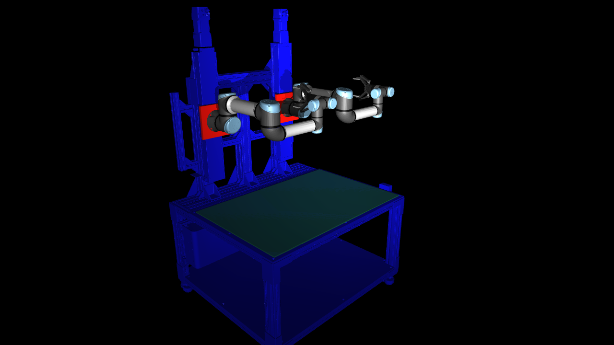

# geodude_assets

MuJoCo models for the Geodude bimanual robot.



## Installation

```bash
uv add geodude_assets
```

Or from source:
```bash
git clone https://github.com/personalrobotics/geodude_assets.git
cd geodude_assets
uv sync
```

## Quick Start

```python
import mujoco
from geodude_assets import get_model_path

# Load the Geodude robot
model = mujoco.MjModel.from_xml_path(str(get_model_path()))
data = mujoco.MjData(model)

# Reset to home pose
mujoco.mj_resetDataKeyframe(model, data, 0)

# Step simulation
mujoco.mj_step(model, data)
```

View the robot in MuJoCo's interactive viewer:
```bash
uv run python -m mujoco.viewer --mjcf="$(uv run python -c 'from geodude_assets import get_model_path; print(get_model_path())')"
```

### Collision Viewer

An interactive collision viewer is available to visualize collision geometry and contact detection:
```bash
uv run mjpython examples/view_collisions.py
```

- Use joint sliders to move the robot (Tab to show/hide control panel)
- Colliding bodies turn **red**
- Press `3` to toggle collision geometry visibility
- Press `C` to toggle contact point visualization
- Press `R` to reset to home position

## Swapping End Effectors

The default Geodude model has Robotiq 2F-140 grippers on both arms. To use different end effectors (e.g., Ability Hands), use the assembly module:

```bash
uv add geodude_assets[assembly]
```

### Python API

```python
from geodude_assets.assembly import attach_arms_to_vention

# Robotiq grippers on both arms (default)
model = attach_arms_to_vention(
    save_file=False,
    dir=".",
    filename="geodude.xml",
    left_gripper_type="2f140",
    right_gripper_type="2f140",
)

# Ability Hands on both arms
model = attach_arms_to_vention(
    save_file=False,
    dir=".",
    filename="geodude.xml",
    left_gripper_type="abhl",
    right_gripper_type="abhr",
)

# Mixed: Ability Hand on left, Robotiq on right
model = attach_arms_to_vention(
    save_file=False,
    dir=".",
    filename="geodude.xml",
    left_gripper_type="abhl",
    right_gripper_type="2f140",
)

# No grippers (bare UR5e arms)
model = attach_arms_to_vention(
    save_file=False,
    dir=".",
    filename="geodude.xml",
    left_gripper_type=None,
    right_gripper_type=None,
)
```

### Command Line

```bash
# Generate and save a custom configuration
uv run python -m geodude_assets.assembly --save-mjcf -d ./output -l abhl -r 2f140
```

### Available End Effectors

| Type | Description |
|------|-------------|
| `2f140` | Robotiq 2F-140 parallel jaw gripper |
| `abhl` | Psyonic Ability Hand (left) |
| `abhr` | Psyonic Ability Hand (right) |
| `None` | No gripper (bare UR5e wrist) |

## Robot Configuration

The Geodude robot consists of:
- **Vention frame** with vertical linear rails (enclosed lead screw actuators)
- **Two UR5e arms** mounted on the linear rails
- **End effectors** on each arm (configurable)
- **Worktop** - a named site marking the usable work surface

### Named Sites

| Site | Position | Size | Description |
|------|----------|------|-------------|
| `worktop` | (0, -0.35, 0.755) | 1.2m × 0.8m | Usable work surface on the Vention base |

The worktop site is visualized as a semi-transparent green box and can be used by planners to define placement regions:

```python
import mujoco
from geodude_assets import get_model_path

model = mujoco.MjModel.from_xml_path(str(get_model_path()))
site_id = mujoco.mj_name2id(model, mujoco.mjtObj.mjOBJ_SITE, "worktop")
worktop_pos = model.site_pos[site_id]   # [0, -0.35, 0.755]
worktop_size = model.site_size[site_id]  # [0.6, 0.4, 0.005] (half-extents)
```

### Actuators

| Actuator | Range | Description |
|----------|-------|-------------|
| `left_linear_actuator` | 0-0.5m | Left arm vertical position (0=bottom, 0.5=top) |
| `right_linear_actuator` | 0-0.5m | Right arm vertical position |
| `left_ur5e/shoulder_pan` | ±π | Left arm joint 1 |
| `left_ur5e/shoulder_lift` | ±π | Left arm joint 2 |
| `left_ur5e/elbow` | ±π | Left arm joint 3 |
| `left_ur5e/wrist_1` | ±π | Left arm joint 4 |
| `left_ur5e/wrist_2` | ±π | Left arm joint 5 |
| `left_ur5e/wrist_3` | ±π | Left arm joint 6 |
| `right_ur5e/...` | ... | Right arm joints (same as left) |
| `left_ur5e/gripper/fingers_actuator` | 0-255 | Left gripper (0=open, 255=closed) |
| `right_ur5e/gripper/fingers_actuator` | 0-255 | Right gripper |

## Available Models

| Model | Description |
|-------|-------------|
| `geodude` | Full robot: two UR5e arms on Vention base with Robotiq 2F-140 grippers |
| `universal_robots_ur5e` | Single UR5e arm |
| `robotiq_2f140` | Robotiq 2F-140 parallel jaw gripper |
| `vention` | Vention aluminum frame base with linear rails |
| `abh_left_small` | Psyonic Ability Hand (left, small) |
| `abh_right_small` | Psyonic Ability Hand (right, small) |

Load individual component models:
```python
from geodude_assets import get_model_path

ur5e_path = get_model_path("universal_robots_ur5e")
gripper_path = get_model_path("robotiq_2f140")
```

## Development

```bash
uv sync --dev

# Lint
uv run ruff check .
uv run ruff format .

# Test
uv run pytest
```

To regenerate the default geodude model:
```bash
uv sync --extra assembly
uv run python -m geodude_assets.assembly --save-mjcf -d src/geodude_assets/models/geodude -l 2f140 -r 2f140
```

## License

MIT
